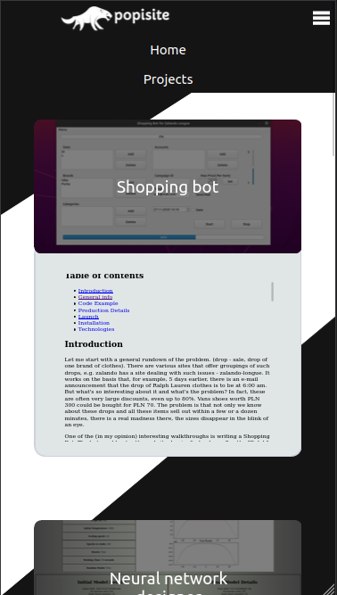

# Portfolio

## Table of contents

- [Portfolio](#portfolio)
    - [Table of contents](#table-of-contents)
    - [Introduction](#introduction)
    - [Launch](#launch)
    - [General Info](#general-info)
        - [Database](#database)
          - [Tables](#tables)
        - [Frontend](#frontend)
            - [Home](#home)
            - [Interests](#interests)
        - [Projects](#projects)
        - [Login](#login)
        - [Forum Threads](#forum-threads)
        - [Thread](#thread)

    - [Code Example](#code-example)
    - [Technologies](#technologies)

## Introduction

Fully responsive website presents my computer science portfolio. Specification can be found in `www-l1.pdf`
and `www-l3.pdf` included into this repository.

Main functionalities/ pages available in project:

- home page ( stores some information about my interests, skills and way of contact )
- projects page ( dedicated to preview all my best projects that I had struggled with )
- login/ registration system ( sign up gives access to forum, threads are my projects where users can discuss them via
  comments )
- forum/ threads page ( after logging user can comment all my projects, this option need a connection with a database. I
  had used MySQL with lampp ( apache ) )

Pages are enriched with javascript, stylesheets had been written using compass and sass.

## Launch

Website is available under this link [popsite](https://sqoshi.github.io).

Unfortunately, GitHub pages does not handle MySQL database so PHP code is `useless` (version limited to CSS, SASS, HTML
and JAVASCRIPT).

If you want to use full version, you will need to create database and run php server. Under directory `resources/sql`
you may find a source `sql` code to recreate this database.

I recommend `lampp` to run php server with `mysql` and `apache2`.

## General Info

Website had been designed in accordance with rule `mobile first`.

### Database

#### Tables

<!DOCTYPE svg
PUBLIC "-//W3C//DTD SVG 1.1//EN"
       "http://www.w3.org/Graphics/SVG/1.1/DTD/svg11.dtd">
<svg viewBox="225 418 919 574" width="694px" height="156px" xmlns="http://www.w3.org/2000/svg" version="1.1">
   <rect width="81" height="20" x="508" y="433" style="fill:#007;stroke:black;"/>
   <text width="81" height="20" x="513" y="447" style="fill:#fff;" font-family="Arial" font-size="16px"> comments</text>
   <rect width="81" height="20" x="508" y="453" style="fill:#aea;stroke:black;"/>
   <text width="81" height="20" x="513" y="467" style="fill:black;" font-family="Arial" font-size="16px">id</text>
   <rect width="81" height="20" x="508" y="473" style="fill:none;stroke:black;"/>
   <text width="81" height="20" x="513" y="487" style="fill:black;" font-family="Arial" font-size="16px">username</text>
   <rect width="81" height="20" x="508" y="493" style="fill:none;stroke:black;"/>
   <text width="81" height="20" x="513" y="507" style="fill:black;" font-family="Arial" font-size="16px">content</text>
   <rect width="81" height="20" x="508" y="513" style="fill:none;stroke:black;"/>
   <text width="81" height="20" x="513" y="527" style="fill:black;" font-family="Arial" font-size="16px">project</text>
   <rect width="81" height="20" x="240" y="459" style="fill:#007;stroke:black;"/>
   <text width="81" height="20" x="245" y="473" style="fill:#fff;" font-family="Arial" font-size="16px"> users</text>
   <rect width="81" height="20" x="240" y="479" style="fill:#aea;stroke:black;"/>
   <text width="81" height="20" x="245" y="493" style="fill:black;" font-family="Arial" font-size="16px">id</text>
   <rect width="81" height="20" x="240" y="499" style="fill:none;stroke:black;"/>
   <text width="81" height="20" x="245" y="513" style="fill:black;" font-family="Arial" font-size="16px">username</text>
   <rect width="81" height="20" x="240" y="519" style="fill:none;stroke:black;"/>
   <text width="81" height="20" x="245" y="533" style="fill:black;" font-family="Arial" font-size="16px">password</text>
   <rect width="81" height="20" x="240" y="539" style="fill:none;stroke:black;"/>
   <text width="81" height="20" x="245" y="553" style="fill:black;" font-family="Arial" font-size="16px">created_at</text>
   <rect width="81" height="20" x="823" y="436" style="fill:#007;stroke:black;"/>
   <text width="81" height="20" x="828" y="450" style="fill:#fff;" font-family="Arial" font-size="16px"> visits</text>
   <rect width="81" height="20" x="823" y="456" style="fill:#aea;stroke:black;"/>
   <text width="81" height="20" x="828" y="470" style="fill:black;" font-family="Arial" font-size="16px">id</text>
   <rect width="81" height="20" x="823" y="476" style="fill:none;stroke:black;"/>
   <text width="81" height="20" x="828" y="490" style="fill:black;" font-family="Arial" font-size="16px">ip</text>
   <rect width="81" height="20" x="823" y="496" style="fill:none;stroke:black;"/>
   <text width="81" height="20" x="828" y="510" style="fill:black;" font-family="Arial" font-size="16px">last_visit</text>
</svg>

### Frontend

#### Home


#### Interests


### Projects

`mobile version`



#### Login 


#### Forum Threads


#### Thread


## Code Example

``` html
<div class="project-tile">
     <div class="project-object">
      <div class="project-container" onclick="toggle_project_info(this)">
       
       <div class="project-object-img-overlay">
       </div>
       <p class="project-object-name">
        GPA calculator
       </p>
      </div>
     </div>
     <div class="project-info">
      <div class="text">
       <embed class="readme" src="resources/readmes/gpa.html"/>
      </div>
     </div>
    </div>
```

`views counter`

```php

<?php
require_once "config.php";
if (!empty($_SERVER['HTTP_CLIENT_IP'])) {
    $ip = $_SERVER['HTTP_CLIENT_IP'];
} elseif (!empty($_SERVER['HTTP_X_FORWARDED_FOR'])) {
    $ip = $_SERVER['HTTP_X_FORWARDED_FOR'];
} else {
    $ip = $_SERVER['REMOTE_ADDR'];
}


$query = "SELECT * FROM `visits` WHERE ip = ? AND last_visit < NOW()";
$stmt = $link->prepare($query);
$stmt->bind_param('s', $ip);
$stmt->execute();

$result = $stmt->get_result();
if ($result->num_rows == 0) {
    $sql = "INSERT INTO `visits` (ip, last_visit) VALUES (?, NOW())";
    if ($stmt = mysqli_prepare($link, $sql)) {
        mysqli_stmt_bind_param($stmt, "s", $ip);
        mysqli_stmt_execute($stmt);
        mysqli_stmt_close($stmt);
    }
}
$stmt->free_result();
$stmt->close();


$query = "SELECT * FROM `visits`";
$stmt = $link->prepare($query);
$stmt->execute();
$result = $stmt->get_result();
echo "<div style='width:100%;display: flex;justify-content: center;'><p>Views: $result->num_rows </p></div>";
$stmt->free_result();
$stmt->close();


$link->close();

```

## Technologies

- CSS
- SASS
- HTML
- Javascript
- PHP
- MySQL