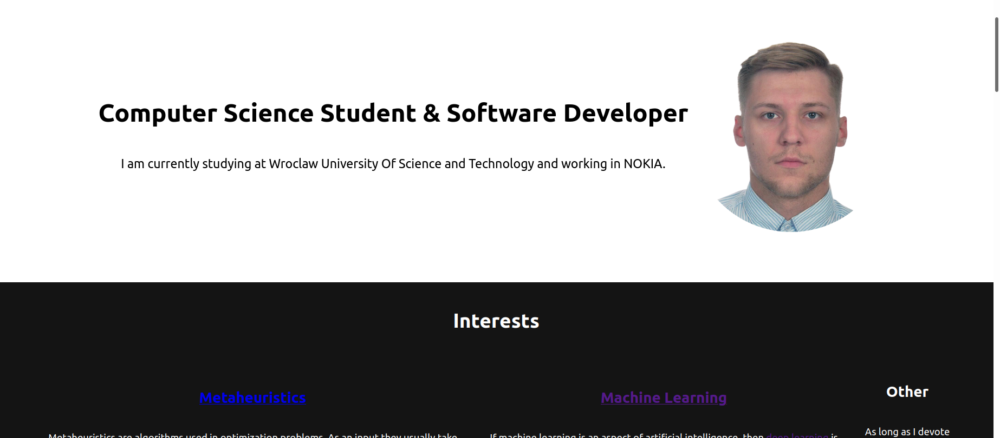

# Portfolio
## Table of contents

- [Portfolio](#portfolio)
  - [Table of contents](#table-of-contents)
  - [Introduction](#introduction)
  - [Launch](#launch)
  - [General Info](#general-info)
    - [Desktop front page](#desktop-front-page)
      - [Intro](#intro)
      - [Interests](#interests)
    - [Mobile version](#mobile-version)
  - [Code Example](#code-example)
  - [Technologies](#technologies)
## Introduction

Fully responsive website in pure css, html and just a few lines of javascript. That limitation of javascript language is due to university course list requirement. Anyway, it did not affect  significantly performance of website. Specification can be found in `www-l1.pdf` included into this repository.

## Launch
Website is available under this link [popsite](https://sqoshi.github.io).

## General Info
Website had been designed in accordance with rule `mobile first`.
### Desktop front page
#### Intro

#### Interests

### Mobile version


## Code Example
``` html
<div class="project-tile">
     <div class="project-object">
      <div class="project-container" onclick="toggle_project_info(this)">
       
       <div class="project-object-img-overlay">
       </div>
       <p class="project-object-name">
        GPA calculator
       </p>
      </div>
     </div>
     <div class="project-info">
      <div class="text">
       <embed class="readme" src="resources/readmes/gpa.html"/>
      </div>
     </div>
    </div>
```


## Technologies

- CSS
- HTML
- Javascript
