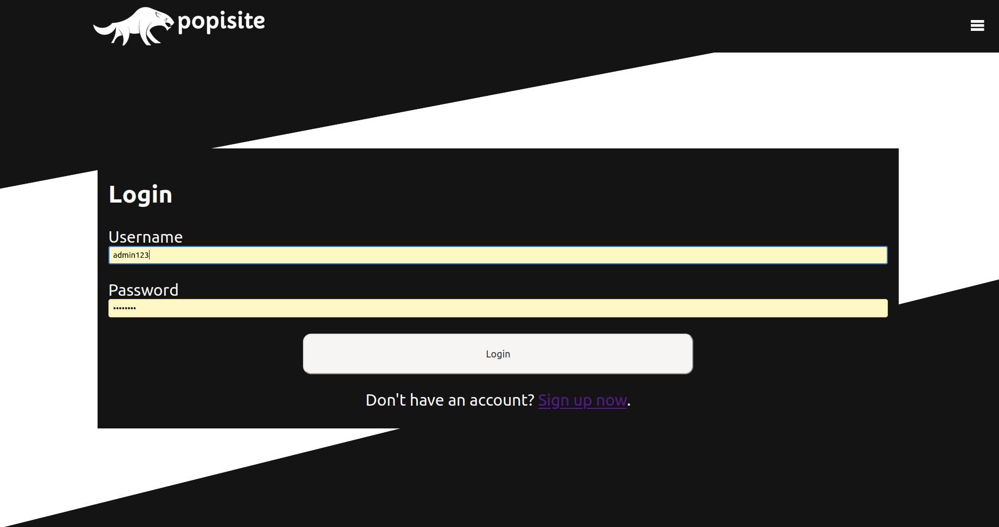
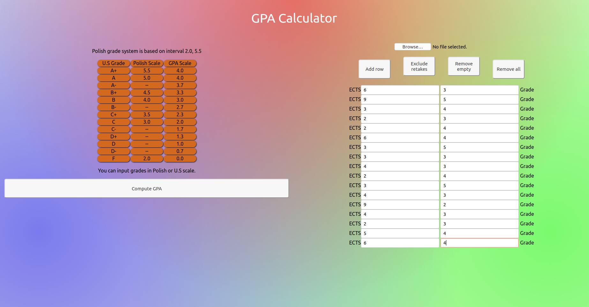

# Portfolio

## Table of contents

- [Portfolio](#portfolio)
  - [Table of contents](#table-of-contents)
  - [Introduction](#introduction)
  - [Launch](#launch)
  - [General Info](#general-info)
    - [Database](#database)
      - [Tables](#tables)
    - [Frontend](#frontend)
      - [Home](#home)
      - [Interests](#interests)
    - [Projects](#projects)
      - [Login](#login)
      - [Forum Threads](#forum-threads)
      - [Thread](#thread)
  - [Code Example](#code-example)
  - [Technologies](#technologies)

    - [Code Example](#code-example)
    - [Technologies](#technologies)

## Introduction

Fully responsive website presents my computer science portfolio. Specification can be found in `www-l1.pdf`
and `www-l3.pdf` included into this repository.

Main functionalities/ pages available in project:

- home page ( stores some information about my interests, skills and way of contact )
- projects page ( dedicated to preview all my best projects that I had struggled with )
- login/ registration system ( sign up gives access to forum, threads are my projects where users can discuss them via
  comments )
- forum/ threads page ( after logging user can comment all my projects, this option need a connection with a database. I
  had used MySQL with lampp ( apache ) )

Pages are enriched with javascript, stylesheets had been written using compass and sass.

## Launch

Website is available under this link [popsite](https://sqoshi.github.io).

Unfortunately, GitHub pages does not handle MySQL database so PHP code is `useless` (version limited to CSS, SASS, HTML
and JAVASCRIPT).

If you want to use full version, you will need to create database and run php server. Under directory `resources/sql`
you may find a source `sql` code to recreate this database.

I recommend `lampp` to run php server with `mysql` and `apache2`.

## General Info

Website had been designed in accordance with rule `mobile first`.

### Database

#### Tables


### Frontend

#### Home


#### Interests


### Projects

`mobile version`


#### Login 




#### Forum Threads


#### Thread


## Code Example

``` html
<div class="project-tile">
     <div class="project-object">
      <div class="project-container" onclick="toggle_project_info(this)">
       
       <div class="project-object-img-overlay">
       </div>
       <p class="project-object-name">
        GPA calculator
       </p>
      </div>
     </div>
     <div class="project-info">
      <div class="text">
       <embed class="readme" src="resources/readmes/gpa.html"/>
      </div>
     </div>
    </div>
```

`views counter`

```php

<?php
require_once "config.php";
if (!empty($_SERVER['HTTP_CLIENT_IP'])) {
    $ip = $_SERVER['HTTP_CLIENT_IP'];
} elseif (!empty($_SERVER['HTTP_X_FORWARDED_FOR'])) {
    $ip = $_SERVER['HTTP_X_FORWARDED_FOR'];
} else {
    $ip = $_SERVER['REMOTE_ADDR'];
}


$query = "SELECT * FROM `visits` WHERE ip = ? AND last_visit < NOW()";
$stmt = $link->prepare($query);
$stmt->bind_param('s', $ip);
$stmt->execute();

$result = $stmt->get_result();
if ($result->num_rows == 0) {
    $sql = "INSERT INTO `visits` (ip, last_visit) VALUES (?, NOW())";
    if ($stmt = mysqli_prepare($link, $sql)) {
        mysqli_stmt_bind_param($stmt, "s", $ip);
        mysqli_stmt_execute($stmt);
        mysqli_stmt_close($stmt);
    }
}
$stmt->free_result();
$stmt->close();


$query = "SELECT * FROM `visits`";
$stmt = $link->prepare($query);
$stmt->execute();
$result = $stmt->get_result();
echo "<div style='width:100%;display: flex;justify-content: center;'><p>Views: $result->num_rows </p></div>";
$stmt->free_result();
$stmt->close();


$link->close();

```

## Technologies

- CSS
- SASS
- COMPASS
- HTML
- Javascript
- PHP
- MySQL